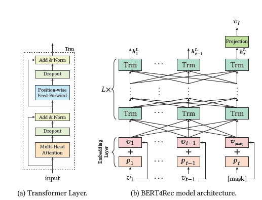
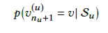
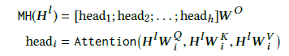
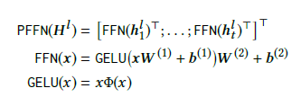
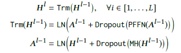
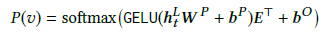
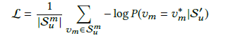
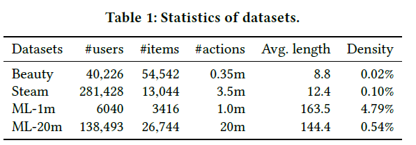

# BERT4Rec: Sequential Recommendation with Bidirectional Encoder Representations from Transformer

## Abstract
- 기존의 방법들은 사용자의 이전 기록을 왼쪽에서 오른쪽으로 hidden representaion을 생성하여 추천 알고리즘을 만들었음
- 하지만 왼쪽에서 오른쪽인 순차적인 학습은 아래와 같은 문제점을 가지고 있음
    - 단방향 아키텍처는 사용자의 행동 시퀀스에 제약을 둔다.
    - 현실적이지 않은 순서를 가정
- 위와 같은 문제를 해결하기 위해 양방향 유저 모델링 BERT4Rec을 제안
- 정보의 누출과 효과적인 학습을 위하여 Cloze objective를 적용
    - 이는 데이터를 마스킹한 데이터를 예측하여 해당 항목의 왼쪽과 오른쪽를 조건으로 설정
    - 이로 양쪽의 문맥의 정보를 융합할 수 있음

## INTRODUCTION
- 현실에서 사용자의 현재 관심사는 이전 행동에 영향을 받을 수 있음
- 이전의 연구는 순차 추천이 주를 이루며, RNN과 같은 알고리즘을 통해 순차적인 상호작용을 Vector로 인코딩하여 예측에 사용하고 있음
- 단방향 모델은 아래와 같은 제한을 지님
    - 각각의 아이템은 오직 이전 아이템으로부터 인코딩을 함
    - 데이터는 text나 time과 같은 순차적인 조건을 가지지만, 현실은 이를 가정하기 못하는 경우가 많음
- 위와 같은 제한을 극복하기 위하여 text model에서 성공을 거둔 BERT를 채택
- 그러나, 추천에서의 양방향은 미래의 정보를 간접적으로 학습에 사용하여 leakage가 일어날 수 있음
- Cloze task를 사용하여 위 문제를 해결
    - 입력 시퀀스를 랜덤하게 masking 하여 id를 예측
    - 다수의 샘플을 생성하여 여러 에포크에서 더 강력한 모델을 생성(?)
    - 순차적인 예측과 목적이 달리지지만, mask토큰을 마지막에 추가하여 벡터 기반의 추천을 생성할 수 있게 함

## RELATED WORK

### General Recommendation
- 추천 시스템에서 유저의 상호작용을 기반으로 하는 CF가 존재
    - MF : user와 item의 vector 차원을 공유하며 user의 행동과 item의 vector 값을 내적
    - item-based neighborhood : item 간의 유사도 행렬을 이용하여 사용자의 기록과 비교
- 최근 deeplearning 기반으로 하는 NCF, autoencoder를 사용하는 계열도 많음

### Sequential Recommenation
- 보통 순차적인 추천은 MC와 같이 순서를 반영 함
- GRU와 LSTM은 순차 추천에서 큰 인기를 얻으며 유저의 이전 행동 패턴을 vector와 시키는 아이디어를 가짐
- 이외의 다양한 딥러닝 기법을 사용하는 Caser, STAMP 등이 존재

### Attention Mechanism
- Attention은 높은 잠재력을 지니고 있음
- 이전에는 Atention을 추가적인 컴포넌트로 기존 모델에 추가함
- Transfomer와 BERT는 multi-head-self-attention으로 구성되어 있음
- SASRec과 비슷하지만, Cloze task를 통해 양방향성을 이용

## BERT4REC
### Problem Statement
- 순차 추천의 목적은 사용자의 상호작용이 주어졌을 때, 그 다음 경우의 아이템을 예측하는 것

### Model Architecture
- BERT4Rec은 L개의 양방향 transfomer layer를 지니고 있으며 이전 레이어의 위치 정보를 병렬로 교환하여 표현을 계속하여 수정
- CNN과 달리 전역적인 수용 능력을 지니며, RNN과 비교하여 병렬적인 처리에 강함을 보임

### Transformer Layer
- 길이가 t인 입력 시퀀스로 각 layer에 위치 i에 대한 은닉표현 h_i를 동시에 반복적으로 계산
- Transfomer layer는 Multi-head self-attention과 Position-wise Feed-Forward Network를 가짐
- Multi-head self-atteion
    - 시퀀스 내에서 거리에 관계없이 표현의 한 쌍의 의존성을 확인하는데 도움을 줌
    - 각 헤드에 query, key, value를 곱한 값은 학습이 가능함
    
- Postion-wise Feed-Forward Network
    - self-attention은 주로 선형곱이기 때문에 모델의 비선형성과 서로 다른 차원의 상호작용을 부여하기 위하여 PFFN을 적용
    - 각 위치에 대하여 독립적으로, 동일하게 적용
    
- Stacking Transfomer Layer
    - self-attention layer는 유저의 행동 시퀀스를 통해 item-item 관계를 도출하고 복잡성을 위해 더 많은 layer를 쌓지만 학습이 어려워 짐
    - 이를 방지하기 위해 residual connection을 추가한 후 layer nomalization을 적용하며 각 서브레이어에 Dropout을 적용하여 과적합을 방지
    

### Embedding Layer
- Transfomer layer는 위치 정보를 습득하기 위하여 마지막 레이어 스택의 가장 아래에 위치 임베딩을 추가
- 아이템 v_i에 대하여 입력표현h는 아이템 임베딩(v_i)와 위치 임베딩(p_i)의 합
- 입력 시퀀스의 길이가 길 경우 t개로 짤라서 입력

### Output Layer
- 입력 시퀀스의 모든 아이템에 대한 최종 출력 H^L을 습득
- 입력과 출력에 사용되는 아이템 임베딩 행렬을 사용하여 과적합을 완화하고 모델 사이즈를 줄임

### Model Learning
- 양방향 학습 방법은 미래의 정보를 입력으로 얻기 때문에 학습이 어려움
- t-1개의 샘플을 각각 나눠서 학습하면 되지만, 이는 시간과 자원이 너무 많이 소요 함
- 이를 위해 Colze task를 수행
    - 입력 시퀀스에서 p의 비율만큼 랜덤하게 마스킹 처리하는 것
    - 랜덤으로 masking하여 더 많은 train sample을 만들 수 있음
- mask의 최종 벡터는 기존 순차 추천과 같이 아이템 집합에 대한 softmax
- 입력 시퀀스의 마지막 부분은 mask하는 샘플도 생성하여 성능을 향상

### Discussion
- SASRec은 BERT4Rec의 단방향, 싱글 어텐션 헤드 버전. 순서 안에서 각 위치의 다음 아이템을 예측
- CBOW는 BERT4Rec에서 single attention layer, uniform attention weights, 임베딩 공유 X, 중앙만 마스킹, 위치 임베딩 X
- SG는 하나를 제외한 모든 아이템 masking
- BERT에서 영감을 받았지만 차이점이 존재
    - BERT4Rec은 end-to-end 모델이고, BERT는 사전학습 모델
    - BERT4Rec은 다음 문장 손실과 세그먼트 임베딩을 제거 <- 사용자는 하나의 시퀀스이기 때문

## EXPERIMENT

### Dataset

- implicit data로 변환
- 사용자 별로 최소 5개의 상호작용

### Tast Setting & Evaluation Metrics
- leave-one-out 방식 채택
- user가 상호작용하지 않은 100개(인기순)를 negative sampling
- Metrics은 HR과 NDCG 1,5,10 채택
- BERT4Rec 설정
    - 모든 파라미터는 [-0.02,0.02] 정규 분포
    - Adam
    - learning late = 1e-4, β1 = 0.9, β2 = 0.999, ℓ2 가중치 감소는 0.01
    - learning late는 선형적으로 감소
    - 기울기가 ℓ2 노름이 5를 초과할 경우 기울기 클리핑을 적용
    - 레이어 수 L = 2, 헤드 수 h = 2
    - ML-1m 및 ML-20m의 경우 N = 200, Beauty 및 Steam 데이터셋은 N = 50
    - 헤드 설정에 대해서는 각 헤드의 차원을 32로 설정
    - ρ는 masking 비율 / Beauty는 ρ = 0.6, Steam은 ρ = 0.4, ML-1m 및 ML-20m은 ρ = 0.2

### Overall Performance Comparison
- masking을 하나만 하여 SASRec과 비교하였을 때 유의미한 결과 -> 양방향 학습이 좋은 성능임을 증명
- masking 개수로 비교하여 1개가 있는 경우보다 적절한 비율이 있는 것이 더 좋음 -> Cloze task가 긍정적인 영향을 줌
- hidden dimensionality가 높을수록 수렴하지만, 반드시 더 높은 성능을 띄는 것은 아님. 특히 sparse한 데이터에서는 성능 향샹을 보이지 않음
- masking 비율은 데이터 셋의 길이에 따라 최적의 비율이 결정 됨