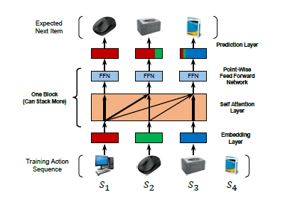

# Self-Attensive Sequential Recommendation (SASRec)

## Abstract

- sequential한 추천을 위해서는 사용자의 context를 기반으로 하는 연구가 활발
- Markov Chains(MCs)과 RNNs을 이용하여 사용자의 패턴을 수집하고 있음
- MCs : 사용자의 가장 최근(또는 몇개)의 데이터를 사용 / 모델의 단순성으로 인하여 sparse한 dataset에서 더 좋은 성능을 보임
- RNNs : 조금 더 긴 semantic을 가짐 / 모델의 복잡성으로 인하여 denser한 dataset에서 더 좋은 성능을 보임
- SASRec은 사용자와 관련성이 있음을 추론하여 MCs와 RNNs의 장점을 취함
- SASRec이 다양한 모델에서 좋은 성능을 보임

## I.Introcuction
- 추천시스템의 목표는 사용자의 과거 이력과 최근 행동으로 context를 결합하는 것
- 과거의 행동을 입력 데이터가 많을 수록 차원이 기하급수적으로 증가하기 때문에 간결하게 특성을 포착하는 것이 중요
- MC는 최신 사용자의 데이터를 사용하기 때문에 high-sparse한 데이터에서 뛰어남
- RNN은 hidden stage로 데이터를 요약하기 때문에 많은 양의 데이터가 필요함
- Transfomer가 발표되었는데 이는 단어 간 패턴을 효율적으로 찾는 'self-attention' 매커니즘을 사용한다.
- 위 매커니즘에 영향을 받아서 SASRec을 구축하였으며 아래 그림과 같이 time step에 따라서 가중치를 부여하였다.

## II. Related Work
- General Recommendation
    - 추천 시스템은 유저와 이이템간의 상호작용의 적합성에 대하여 초점을 가지고 있음
    - 유저의 피드백은 explicit(평점 등)과 implicit(클릭 유무, 구매 유무 등)으로 존재
    - implicit 피드백은 관측되지 않은 아이템에 대한 문제가 있는데 point-wise과 pairwise이 제안 됨
        - **point-wise : 각 item에 관한 평점을 예측하여 rank를 매기는 방식, 각 user의 선호도를 반영하지 못하여서 유저별 ranking보다는 평점을 prediction하는 문제에 많이 사용**
        - **pairwise : user와 item의 쌍으로 입력하여 user별 item의 상대적인 선호도 학습이 가능, (user, postive_sample, nagetive_sample)로 입력하여 nagetive-sampling 방식에 큰 영향을 받음**
    - Matrix Factorization(MF)는 user와 item의 잠재 차원을 표현하기 위하여 user와 item의 embedding을 내적함
    - Item Similarity Models(ISM)을 기반으로 유저의 latent facotrs를 표현하지 않는 모델(FISM)도 존재, 아이템 간의 유사도를 학습하고 사용자의 과거 상호작용을 통해 items의 선호도를 측정
    - 딥러닝을 통한 이미지로 item의 context를 추출하거나 NeuMF처럼 MLP를 이용한 방식이 부상

- Tempral Recommendation
    - user 활동의 timesteamp를 명시적으로 모델링 하여 다양한 task에 강력한 성능을 보여주고 있음
    - TimeSVD++은 user와 item을 분리하여 나눔으로써 좋은 성능을 가졌음, 계절과 같은 장기적인 시점이나 특정 시간과 같이 단기적인 시점을 이해하는 것이 중요
    - 그러나, Sequential recommendation은 위와 다른 특성을 나타냄, 시간과 독립적이며 사용자의 최근 활동을 기반으로 context를 학습 함

- Sequential Recommendation
    - 많은 순서 추천 시스템은 item간의 순서적인 패턴을 학습하려고 함
    - 예를 들어, FPMC는 MF와 item간의 텀을 통하여 장,단기적인 선호를 포착함, MC를 기반으로 higher-order MC를 사용하여 과거의 이력을 사용
    - MC는 sparse한 데이터 셋에 좋은 성능을 보임, CNN기반인 Caswer는 이전의 item 행렬을 이미지로 취급하여 컨볼루션하며, RNN베이스인 GRU4Rec은 과거와 현재의 action을 이용하여 계산

- Attention Mechanisms
    - Attention mechanisms은 다양한 작업에 효과적인게 증명되었음
    - AFM과 같이 상호작용의 중요도를 학습하는 경우도 존재
    - 그러나, attention 모델은 추가적인 요소 취급되었으며 최근에 순수한 attention model인 Transfomer가 나옴
    - Transfomer는 다음 타겟을 예측하기 위해 관련된 단어를 학습하는 'self-attention'에 의존하며, 이에 영감을 받아서 새로운 모델을 제안

## III. Methodology
- Embedding Layer
    - 훈련 데이터를 사용자 정의 길이 n으로 변환
        - n보다 길이가 길면 n으로 제
        - n보다 작으면 padding을 이용하여 부족한 부분을 채움
    - 아이템 임베딩 M(Ixd,d는 latent dimensionality)을 생성한 후 이를 통해 입력 임베딩 E(nxd)를 구함
    - 아이템의 위치정보를 찾을 수 없기 때문에 이를 위한 위치 임베딩 P(nxd)를 입력에 넣음
- Self-attention Block
    - attention layer : 모든 value의 값의 weighted sum을 계산
    - Self-attention layer
        - NLP : 일반적으로 K = V
        - SASRec : 입력레이어 $\hat{E}$을 선형곱을 이용하여 3개의 matrice으로 변환
    - Causality
        - 특정 시점 t+1에 대하여 예측하기 위해 t까지의 정보만 사용해야하기 때문에 어텐션 메카니즘을 수정
    - Point-Wise Feed-Forward Network
        - self-attention은 궁극적으로 선형 모델이기 때문에 모델 사이 비선형성을 추가하고 latent 차원의 상호작용의 차이점을 고려하기 위해 feed-forward network를 적용
- Stacking Self-Attention Blocks
    - 첫 self-attention block 이후 이전의 모든 item embedding을 통합
    - self-attention block을 쌓으면서 복잡성한 패턴을 학습
    - 그러나 깊이 학습할수록 아래와 같은 문제가 생김
        1) overfitting
        2) 불안정한 학습 프로세스
        3) 더 많이 증가하는 학습 시간
    - 각 block에 입력값 x에 대한 layerNorm을 적용한 후 dropout을 적용하여서 문제를 해결함
    - Residual Connections
        - 일반적으로 layer를 추가하는 것이 더 좋은 성능을 내지는 않지만 residual network로 이를 극복하였음
        - residual network는 낮은 레이어의 특징이 유용하면 그 모델의 최종 레이어까지 전달하기 쉬움, 이것을 SASRec에 적용
    - Layer Normalization
        - 배치 정규화와 달리 각 sample이 독립적임
    - Dropout
        - 과적합을 방지하기 위해 사용
    - Prediction Layer
        - 예측을 위해서 MF를 layer를 채용
        - Shared Item Embedding
            - 모델의 크기를 줄이고 과적합 방지를 위해 단일 item 임베딩을 사용
            - 기존 item embedding은 내적 만으로 item의 관계를 표현하기 어려움
            - SASRec은 비선형으로 학습하기 때문에 문제X
        - Explicit User Modeling
            - 개인화 추천을 위해서 explicit과 implicit을 이용하는 방법이 존재함
            - __SASRec은 implicit한 방식을 채택하며, explicit을 추가할 수 있지만 성능 향상은 없었음__
- Network Training
    - BCEloss 사용
    - adam 옵티마이저 사용
- Complexity Analusis
    - Space Complexity
        - item embedding, position embedding, self-attention, feed-forward, layer norm 학습
        - O(|I|d + nd + d^2)
    - time Complexity
        - O(n^2d + nd^2)을 가지며 O(n^2d)은 feed-forward에서 동작
        - 하지만 병렬 연산이 가능하기에 더 빠르게 동작
    - Handing Long Sequences
        - 짧고 긴 sequence는 검증하였지만 절대적으로 긴 sequence는 확인이 더 필요함
- Discussion
    - SASRec은 전통적인 CF와 유사한 점이 많음
    - FMC
        - Frist-order item transition martix를 이용해서 다음 item 예측
        - self-attention block을 없애고 position-embedding을 적용하지 않은 모습
    - FISM
        - user가 사용한 item과 일반 item의 유사도 계산
        - Feed-forward 부분을 제외한 self-attention layer 중 uniform-weight를 적용한 한 층을 쌓은 형태
    - MC-based
        - 기본적인 MC 방법론은 local sequential pattern 파악에 집중
        - Frist-order 방법론 => sparse한 dataset에 효과적
        - High-order 방법론 => item은 순서가 있어야 하며 최대 5개만 사용 됨
        - SASRec은 위와 같은 단점을 극복하였음, 모델이 알아서 관련있는 item을 판단
    - RNN-based
        - 순차적인 계산
        - SASRec은 병렬 연산이 가능하며, long-range dependecy에도 적용이 가능함

## IV. 개인 회고
    - SASRec의 LOSS에 관련된 논문이 있기에 나중에 찾아서 읽어보기
    - Transfomer를 다시 한번 깊게 파해져보기

## 도움받은 곳
https://doyeon20.tistory.com/24
https://www.youtube.com/watch?v=SLymtSkRJIE
